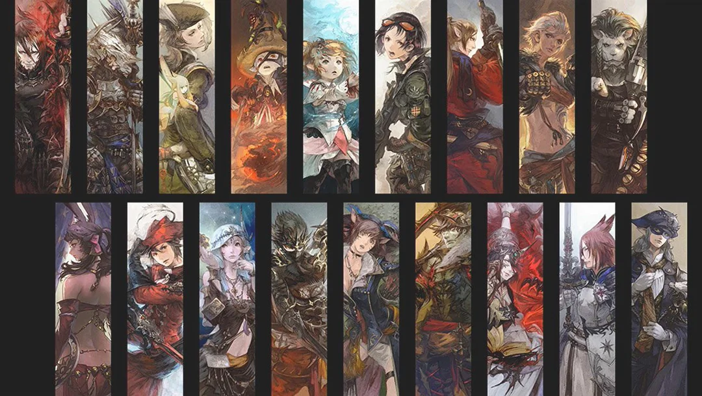

# FF14 ジョブ性格診断

MBTI的な4軸スコアリングをもとに、FINAL FANTASY XIV の全21ジョブへマッピングする性格診断Webアプリです。

🔗 **[サイトを見る](https://panakuro.github.io/xiv21personality/)**

---

## 概要

24の設問に回答すると、あなたの性格傾向からFF14のジョブを診断します。  
診断結果はXでシェアすることができます。



---

## 使用技術

| 分類 | 技術 |
|------|------|
| フロントエンド | HTML / CSS / JavaScript |
| フレームワーク | なし（バニラJS） |
| フォント | Google Fonts（Cinzel / Noto Serif JP） |
| ホスティング | GitHub Pages |

---

## 技術的な工夫

### MBTIスコアリングアルゴリズムの自作
単純な二択ではなく、各設問に **7段階スケール（-3〜+3）** を採用。  
E/I・S/N・T/F・J/P の4軸それぞれのスコアを集計し、重み付き計算でTANK・HEALER・MDPS・RDPS・CDPSの5ロールを判定しています。

```javascript
// 各軸スコアをもとに5ロールへの重み付きスコアを算出
s.TANK   += ei * 0.15;
s.HEALER += ei * 0.18;
s.RDPS   += ei * 0.18;
// ...
```

### 同一MBTIでのロール分岐
同じMBTIタイプでも回答傾向によって異なるジョブに分岐する仕組みを実装。  
Softmax + 決定的PRNG（FNVハッシュ）により、同じ回答なら必ず同じ結果が返るよう設計しました。

### フレームワークなしでのSPA的な画面遷移
React等を使わず、画面の表示切り替え・プログレスバー・ローディング演出をすべて素のJavaScriptで実装しています。

### デバッグシミュレーション機能
URLパラメータ `?debug=1&autorun=1` でランダム10,000回の自動診断を走らせ、全ジョブへの到達率・偏りをCSV出力で確認できる開発用ツールを実装しました。

---

## ページ構成

```
/
├── index.html                  # 診断ページ（メイン）
├── xiv21personality-list.html  # 全ジョブ診断結果一覧
└── image/
    ├── jobart/                 # 各ジョブのイラスト画像
    └── ogp.png                 # OGP画像
```

---

## 対応ジョブ一覧（全21ジョブ）

| ロール | ジョブ |
|--------|--------|
| タンク | ナイト / 戦士 / 暗黒騎士 / ガンブレイカー |
| ヒーラー | 白魔道士 / 学者 / 占星術師 / 賢者 |
| 近接DPS | モンク / 忍者 / リーパー / 侍 / ヴァイパー / 竜騎士 |
| 遠隔DPS | 吟遊詩人 / 踊り子 / 機工士 |
| キャスター | 召喚士 / 黒魔道士 / 赤魔道士 / ピクトマンサー |

---

## 免責事項

本サイトはファンが制作した非公式コンテンツです。  
FINAL FANTASY XIV © SQUARE ENIX CO., LTD. All Rights Reserved.  
「FINAL FANTASY」はスクウェア・エニックス株式会社の登録商標です。
